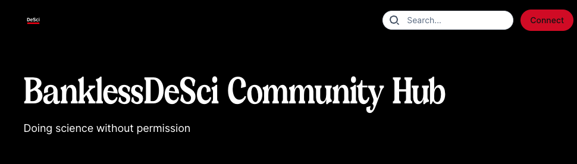
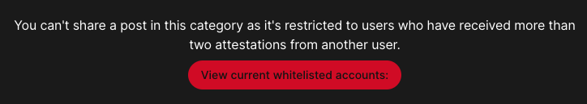
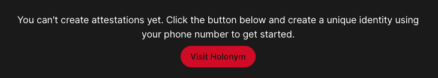
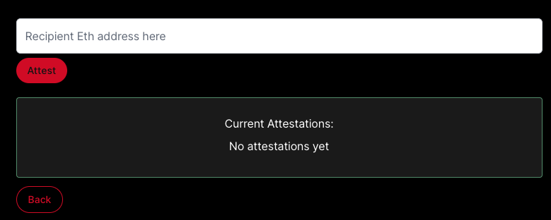
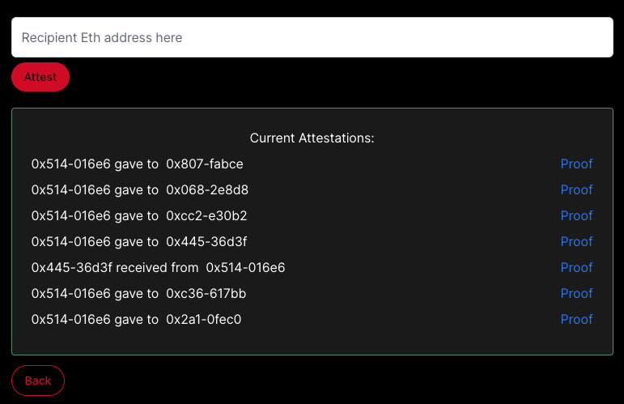
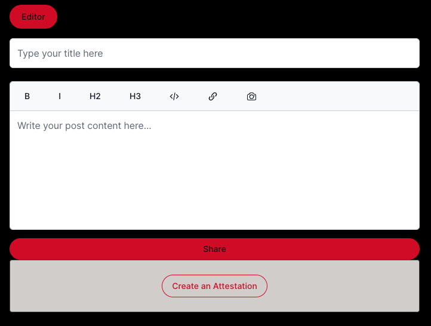

# Attestation-Gated Web3 Forum Template Guide

This guide will walk you through how to use this template to get started setting up your own attestation-gated decentralized forum built with Ceramic (using ComposeDB), Orbis SDK, and Hololym. 

---

## Objectives

At completion of this reading you should be able to:

- Understand how to use the embedded CLI to set up an Orbis project, forum context, and categories for your forum
- Experiment with a local ComposeDB Ceramic node, as well as use both a shared and standalone production node for decentralized storage of your attestations
- Toggle access control conditions that dictate how many attestations a user needs in order to create forum posts or post within particular categories

---

## But First - What is the Ceramic Network?

[Ceramic](https://ceramic.network/) is a decentralized data network build on verifiable event streams. Ceramic leverages the provenance and censorship-resistant qualities you can expect from a blockchain, with cost efficiency and querying capabilities similar to a traditional database. Ceramic empowers developers to leverage composable data formats stored on the Network, helping product teams address "cold-start" data problems while simultaneously allowing individuals to take ownership of their digital presence. Moreover, Ceramic and its broader ecosystem offers developers multiple ways of building within the network - developers can use graph-based databases like ComposeDB, or developer tooling that combines Ceramic with developer-friendly frontend templates such as Orbis SDK.


### Ceramic is a Data Ledger

Ceramic can be considered a "Data Ledger" middle ground between on and off-chain activity. All Ceramic events are periodically rolled into a Merkle tree and the root is published to the Ethereum blockchain, thus ensuring consensus on the global transactions ordering within Ceramic. All data events on Ceramic are also cryptographically signed by the accounts that create them.

For more information on how Ceramic works, visit [How it Works](https://ceramic.network/how-it-works).

## ComposeDB

As mentioned above, ComposeDB is a graph database built on Ceramic that offers further composability and ease of querying to developers. ComposeDB delivers native support for GraphQL and also splits read/write load by default for additional performance. When running a Ceramic node with ComposeDB, developers can define their own [data models](https://developers.ceramic.network/docs/composedb/create-your-composite) using GraphQL, or choose to begin indexing on existing data models already defined by the community, or both!

## Initial Setup

For this guide, you will need:

1. [MetaMask Chrome Extension](https://chrome.google.com/webstore/detail/metamask/nkbihfbeogaeaoehlefnkodbefgpgknn)
2. Node v20

There are two relevant branches that each serve a different purpose for this guide:

1. `attestation-gated` - this branch deploys a local ComposeDB node that runs "inMemory" (designed mostly for local testing). 
2. `gated-shared-node` - this branch is preconfigured with a shared dummy node endpoint running on Ceramic Testnet. You can use this branch if you want to skip over the local node setup, but remember that data written to this node will be broadcasted to the network. this branch also has a subdirectory found in `/prod-node-setup` that walks you through how to set up your own production node and swap out the shared node endpoint.

### Getting Started

First, clone the repository:

```bash
git clone https://github.com/reneedaos/Web3-forum-kit && cd Web3-forum-kit
```

We will first walk through the local node branch and install our dependencies:

```bash
git checkout attestation-gated
npm install
```

Also remember to create a .env file in the base of this directory:

```bash
touch .env
```

You can copy-paste the current contents found in `.env.example` over to your new `.env` file - we will enter corresponding values in the following steps for those fields.

Open the repository in your editor of choice to continue following along.

### Generate Your Author DID

There are two predominant ways applications allow their users to write data to the network. One of these is through [User Sessions](https://developers.ceramic.network/docs/composedb/guides/composedb-client/user-sessions) whereby the application is simply providing the frontend for users to interact and create or mutate Ceramic documents they control. The second represents a situation in which the application should be the owner of a document that refers to a user, or the application wants to retain tight control over a set of documents primarily intended for use within that application environment only (credentials are a good example that fit into this category).

This application will use both design patterns - the "social" artifacts users create (such as forum posts) will be processed through the Orbis SDK and will be owned by the user. Conversely, user-to-user attestations will be written to our ComposeDB node using a static author DID representing our server. Each attestation will be cryptographically signed by the user (thus preserving its fidelity), but we want to retain tight control over this set to be used to gate forum access.

Create your author key using the below command. Copy-paste the resulting string into your `AUTHOR_KEY` field in your .env file:

```bash
npm run author
```

### Generate Your Local Node Configuration

As mentioned above, this branch uses a local node that will need to be configured based on the [ComposeDB Server Configuration](https://developers.ceramic.network/docs/composedb/guides/composedb-server/server-configurations) options. We've done most of this work for you in the script found in `/scripts/commands.mjs`. 

To use this script and generate your credentials, run the following in your terminal:

```bash
npm run generate
```

If you explore your `composedb.config.json` and `admin_seed.txt` files, you will now see a defined JSON ComposeDB server configuration and Ceramic admin seed, respectively.

Copy-paste the resulting string found in your admin_seed.txt file into your `SEED` field in your .env file.

### Generate Your Orbis Configuration

Orbis users have multiple ways to interact with the Orbis toolset. Users can access the [Orbis Dashboard](https://useorbis.com/dashboard) whereby they will use their browser wallet to create project and corresponding contexts and rules. However, as we'll explore later on, the issue with doing this is that we won't be able to programmatically alter our access control conditions in production because each alteration requires the project creator (you) to sign a message in your browser wallet.

Instead, we will use our same seed phrase we generated in the step above to create a DID:Key that will be used to create our project and corresponding categories and contexts within Orbis. Most importantly, this allows us to perform server-side programmatic alterations to our Orbis access control conditions.

To kick this off, run the following from the command line:

```bash
npm run generateOrbis
```

Here's a summary of what you'll be creating:

1. Your overarching project - make sure to give it a name and description
2. Your primary context - this will be used as the parent to all category subcontexts
3. Categories - you can create as many optional categories as you'd like
4. Category gating - you can choose to gate access to some or all of these categories as well

After you've completed the series of prompts, you will see a log note that says "This is your parent context: ". Copy the value starting with a "k" and paste it into your `ORBCONTEXT` field in your .env file. Finally, locate your file found at /pages/_app.js and paste the same value for the corresponding constants: 

`global.orbis_context`
`global.orbis_chat_context`

### Configure Attestation Gating Conditions 

This application is currently configured to allow users with more than two attestations from other users who have already self-verified through Hololym to be dynamically added to the DID whitelist (thus enabling access control). If you navigate to `/components/Editor.js` in your text editor, you will find a method called `updateList` that fetches all instances of Account Attestations and isolates instances where the recipient appears more than once (line 74). After this list has been created, a call to the `/api/update` API is made that determines whether the Orbis context needs to be updated by whitelisting any new DIDs that appear to meet the "greater than 1" attestation condition.

To increase or decrease this, simply change the number found on line 74. 

### Your ComposeDB Schema

We've included your ComposeDB schema definitions found in `/composites/00-attestation.graphql` for reference. However, when we start up our application, we will use a predefined runtime composite (found in `/src/__generated__`) since there are other Ceramic nodes already collaborating on this definition. 

No action needed from you here - we're just pointing this out to show you where this definition lives.

## Start Your Application

You can start your application by first switching to Node V20 and running the following command in your terminal:

```bash
nvm use 20
npm run dev
```

Open [http://localhost:3000](http://localhost:3000) with your browser to see the result.

You should now see the following in your browser:

<div style={{textAlign: 'center'}}>



</div>

### Testing Access Control

After you've logged in, you can click "Create Post" to test our access control. 

The way this application is set up is the following:

1. Categories or entire forums that are "gated" require `X` user-to-user attestations before creating 
2. Users can't create attestations for other users unless they have self-verified (using their phone number) with Hololym.

Depending on whether or not you gated your forum or individual categories, you may see the following message when trying to make a post:

<div style={{textAlign: 'center'}}>



</div>

Additionally, when trying to click "Create an Attestation", you will see the following if you haven't verified yourself:

<div style={{textAlign: 'center'}}>



</div>

Conversely, if you are verified, you should see the following:

<div style={{textAlign: 'center'}}>



</div>

If you've given or received attestations, you might see something like the following:

<div style={{textAlign: 'center'}}>



</div>

For non-gated categories that you try to post to, you should see the default editor appear right away:

<div style={{textAlign: 'center'}}>



</div>

However, as mentioned above, if a category is gated, the `useEffect` hook in `/components/Editor.js` will call `loadContextDetails` to collect whether DID access rules are in place for that category. If they do, `updateList` is called with the StreamID of that category passed in.

`updateList` is responsible for calling the `getList` API (to retrieve all attestations from your ComposeDB node), and then filter through them to identify all unique instances where the recipient value appears more than once from unique attesters. Finally, once that list is isolated, it will call the `update` API which is responsible for determining and facilitating any necessary change to the DID whitelist based on the input and the category.

### Getting Started on a Shared Node

If you want to see what interacting with a production deployment is like, you can check out into the `gated-shared-node` branch. Keep in mind that this is currently set up to a shared dummy node, so it's recommended that you replace with your own production node if running in production.

You will need to follow the same steps we used to configure your author DID, ComposeDB server configuration and seed, and your Orbis project and context setup. However, this time, instead of deploying the attestation models on a local ComposeDB node running on port 7007, the application is already configured to interact with a node that has already been set up to index on our attestation models. 

Finally, once you're ready to set up your own production node, navigate into the `prod-node-setup` directory and follow the instructions outlined for you in the corresponding README for that folder.